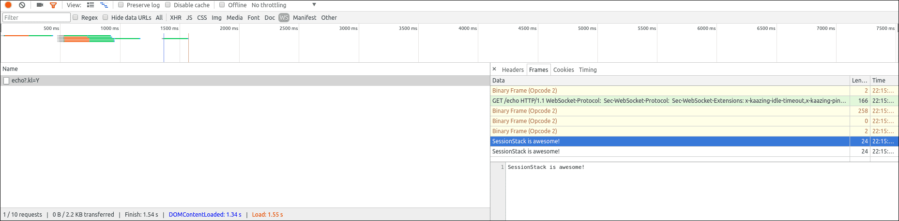

[source](https://blog.sessionstack.com/how-javascript-works-deep-dive-into-websockets-and-http-2-with-sse-how-to-pick-the-right-path-584e6b8e3bf7)

# How JavaScript works: Deep dive into WebSockets and HTTP/2 with SSE + how to pick the right path

This time we’ll dive into the world of communication protocols, mapping and discussing their attributes and building parts on the way. We’ll offer a quick comparison of WebSockets and HTTP/2. At the end, we share some ideas on how to choose which way to go when it comes to network protocols.

## Intro

Nowadays complex web apps that feature rich, dynamic UIs are taken for granted. And it’s not surprising — the internet has come a long way since its inception.

Initially, the internet wasn’t built to support such dynamic and complex web apps. It was conceived to be a collection of HTML pages, linking to one another to form the concept of “web” that contains information. Everything was largely built around the so-called request/response paradigm of HTTP. A client loads up a page and then nothing happens until the user clicks and navigates to the next page.

Around 2005, AJAX was introduced and a lot of people started to explore the possibilities of making connections between a client and а server bidirectional. Still, all HTTP communication was steered by the client, which required user interaction or periodic polling to load new data from the server.

## Making HTTP “bidirectional”

Technologies that enable the server to send data to the client “proactively” have been around for quite some time. “Push” and “Comet” to name a few.

One of the most common hacks to create the illusion that the server is sending data to the client is called long polling. With long polling, the client opens an HTTP connection to the server which keeps it open until a response is sent. Whenever the server has new data that has to be sent, it transmits it as a response.

Let’s see how a very simple long polling snippet might look like:

```JavaScript
(function poll(){
   setTimeout(() => {
      $.ajax({
        url: 'https://api.example.com/endpoint',
        success: data => {
          // Do something with `data`
          // ...

          //Setup the next poll recursively
          poll();
        },
        dataType: 'json'
      });
  }, 10000);
})();
```

This is basically a self-executing function that runs the first time automatically. It sets up the ten (10) second interval and after each async Ajax call to the server, the callback calls ajax again.

Other techniques involve Flash or XHR multipart request and the so-called htmlfiles.

All these workarounds share the same problem though: they carry the overhead of HTTP, which doesn’t make them well-suited for low-latency applications. Think multiplayer first-person shooter games in the browser or any other online game with a realtime component.

## The introduction of WebSockets

The WebSocket specification defines an API establishing “socket” connections between a web browser and a server. In plain words: there is a persistent connection between the client and the server and both parties can start sending data at any time.

The client establishes a WebSocket connection through a process known as the WebSocket handshake. This process starts with the client sending a regular HTTP request to the server. An Upgrade header is included in this request which informs the server that the client wishes to establish a WebSocket connection.

Let’s see how opening a WebSocket connection looks like on the client side:

```JavaScript
// Create a new WebSocket with an encrypted connection.
const socket = new WebSocket('ws://websocket.example.com');
```

> WebSocket URLs use the ws scheme. There is also wss for secure WebSocket connections which is the equivalent of HTTPS.

This scheme just starts the process of opening a WebSocket connection towards websocket.example.com.

Here is a simplified example of the initial request headers.

```
GET ws://websocket.example.com/ HTTP/1.1
Origin: http://example.com
Connection: Upgrade
Host: websocket.example.com
Upgrade: websocket
```

If the server supports the WebSocket protocol, it will agree to the upgrade and will communicate this through the Upgrade header in the response.

Let’s see how this can be implemented in Node.JS:

```JavaScript
// We'll be using the https://github.com/theturtle32/WebSocket-Node
// WebSocket implementation
let WebSocketServer = require('websocket').server;
const http = require('http');

const server = http.createServer((request, response) => {
  // process HTTP request.
});
server.listen(1337, () => {});

// create the server
wsServer = new WebSocketServer({
  httpServer: server
});

// WebSocket server
wsServer.on('request', request => {
  const connection = request.accept(null, request.origin);

  // This is the most important callback for us, we'll handle
  // all messages from users here.
  connection.on('message', message => {
      // Process WebSocket message
  });

  connection.on('close', connection => {
    // Connection closes
  });
});
```

After the connection is established, the server replies by upgrading:

```
HTTP/1.1 101 Switching Protocols
Date: Wed, 25 Oct 2017 10:07:34 GMT
Connection: Upgrade
Upgrade: WebSocket
```

Once the connection has been established, the open event will be fired on your WebSocket instance on the client side:

```JavaScript
const socket = new WebSocket('ws://websocket.example.com');

// Show a connected message when the WebSocket is opened.
socket.onopen = event => console.log('WebSocket is connected.');
```

Now that the handshake is complete the initial HTTP connection is replaced by a WebSocket connection that uses the same underlying TCP/IP connection. At this point, either party can start sending data.

With WebSockets, you can transfer as much data as you like without incurring the overhead associated with traditional HTTP requests. Data is transferred through a WebSocket as messages, each of which consists of one or more frames containing the data you are sending (the payload). In order to ensure the message can be properly reconstructed when it reaches the client each frame is prefixed with 4–12 bytes of data about the payload. Using this frame-based messaging system helps to reduce the amount of non-payload data that is transferred, leading to significant reductions in latency.

Note: It’s worth noting that the client will only be notified about a new message once all of the frames have been received and the original message payload has been reconstructed.

## WebSocket URLs

We briefly mentioned before that WebSockets introduce a new URL scheme. In reality, they introduce two new schemes: ws:// and wss://.

URLs have scheme-specific grammar. WebSocket URLs are special in that that they do not support anchors ( #sample_anchor ).

The same rules apply to WebSocket style URLs as to HTTP style URLs. ws is unencrypted and has port 80 as default, while wss requires TLS encryption and has port 443 as default.

## Framing protocol

Let’s take a deeper look at the framing protocol. This is what the RFC provides us with:

```
      0                   1                   2                   3
      0 1 2 3 4 5 6 7 8 9 0 1 2 3 4 5 6 7 8 9 0 1 2 3 4 5 6 7 8 9 0 1
     +-+-+-+-+-------+-+-------------+-------------------------------+
     |F|R|R|R| opcode|M| Payload len |    Extended payload length    |
     |I|S|S|S|  (4)  |A|     (7)     |             (16/64)           |
     |N|V|V|V|       |S|             |   (if payload len==126/127)   |
     | |1|2|3|       |K|             |                               |
     +-+-+-+-+-------+-+-------------+ - - - - - - - - - - - - - - - +
     |     Extended payload length continued, if payload len == 127  |
     + - - - - - - - - - - - - - - - +-------------------------------+
     |                               |Masking-key, if MASK set to 1  |
     +-------------------------------+-------------------------------+
     | Masking-key (continued)       |          Payload Data         |
     +-------------------------------- - - - - - - - - - - - - - - - +
     :                     Payload Data continued ...                :
     + - - - - - - - - - - - - - - - - - - - - - - - - - - - - - - - +
     |                     Payload Data continued ...                |
     +---------------------------------------------------------------+
```

As of the WebSocket version specified by the RFC, there’s only a header in front of each packet. It’s quite a complex header, however. Here are its building blocks explained:

 - fin (1 bit): indicates if this frame is the final frame that makes up the message. Most of the time the message fits into a single frame and this bit will always be set. Experiments show that Firefox makes a second frame after 32K.

 - rsv1, rsv2, rsv3 (1 bit each): must be 0 unless an extension is negotiated that defines meanings for non-zero values. If a nonzero value is received and none of the negotiated extensions defines the meaning of such a nonzero value, the receiving endpoint must fail the connection.

 - opcode (4 bits): says what the frame represents. The following values are currently in use:

   0x00: this frame continues the payload from the previous.

   0x01: this frame includes text data.

   0x02: this frame includes binary data.

   0x08: this frame terminates the connection.

   0x09: this frame is a ping.

   0x0a: this frame is a pong.

   (As you can see, there are enough values unused; they’ve been reserved for future use).

 - mask (1 bit): indicates if the connection is masked. As it stands right now, every message from a client to a server must be masked and the spec would want to terminate the connection if it’s unmasked.

 - payload_len (7 bits): the length of the payload. WebSocket frames come in the following length brackets:

   0–125 indicates the length of the payload. 126 means that the following two bytes indicate the length, 127 means the next 8 bytes indicate the length. So the length of the payload comes in ~7bit, 16bit, and 64bit brackets.

 - masking-key (32 bits): all frames sent from the client to the server are masked by a 32-bit value that is contained within the frame.

 - payload: the actual data which most likely is masked. Its length is the length of the payload_len.

## Data on the frames

As mentioned above, the data can be fragmented into multiple frames. The first frame that transmits the data has an opcode on it that indicates what sort of data is being transmitted. This is necessary because JavaScript has pretty much nonexistent support for binary data at the time the specification was started. 0x01 indicates utf-8 encoded text data, 0x02 is binary data. Most people will transmit JSON in which case you’d probably want to choose the text opcode. When you emit binary data it will be represented in a browser specific Blob.

The API for sending data through a WebSocket is very simple:

```JavaScript
const socket = new WebSocket('ws://websocket.example.com');
socket.onopen = event => socket.send('Some message'); // Sends data to server.
```

When the WebSocket is receiving data (on the client side), a message event is fired. This event includes a property called data that can be used to access the contents of the message.

```JavaScript
// Handle messages sent by the server.
socket.onmessage = event => {
  let message = event.data;
  console.log(message);
};
```

You can easily explore the data in each of the frames in your WebSocket connection using the Network Tab inside Chrome DevTools:



## Fragmentation

Payload data can be split up into multiple individual frames. The receiving end is supposed to buffer them up until the fin bit is set. So you can transmit the string “Hello World” in 11 packages of 6 (header length) + 1 byte each. Fragmentation is not allowed for control packages. However, the specification wants you to be able to handle interleaved control frames. That’s in case TCP packages arrive in arbitrary order.

The logic for joining frames is roughly the following:

 - receive the first frame

 - remember opcode

 - concatenate frame payload together until the fin bit is set

 - assert that the opcode for each package is zero

