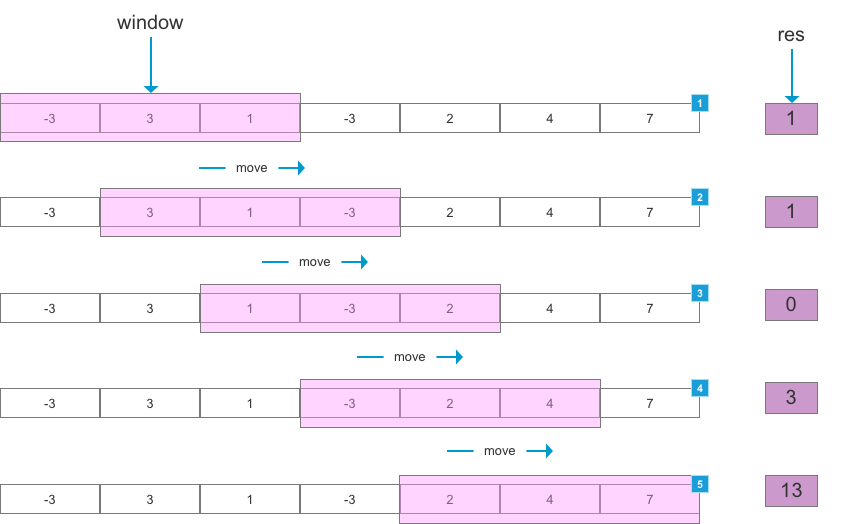
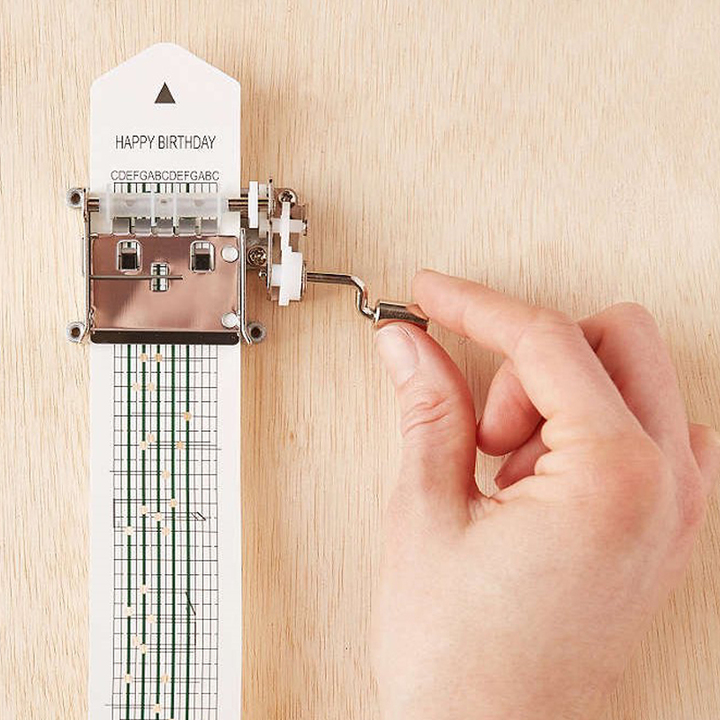

# 滑动窗口算法（Sliding Window Algorithm）

> Sliding window algorithm is used to perform required operation on specific window size of given large buffer or array.

> This technique shows how a nested for loop in few problems can be converted to single for loop and hence reducing the time complexity.

该算法是通过使用特定大小的子列表，在遍历完整列表的同时进行特定的操作，主要降低了循环的嵌套深度。

## 基本示例
如下图所示，window大小为3，当window每次划过数组是，计算当前window中元素的和，得到结果res



理解时可以将数据想象成打孔纸带，滑动窗口便是上面的处理及，每次处理局部数据，进而达到整体数据的处理效果，当然滑动窗口的尺寸可以是固定也可以是动态的，这便需要根据待解决的问题，具体分析。



需要注意的是，滑动窗口算法更多的是一种思想，而非某种数据结构的使用。

## 经典使用

### 和最大的元素

#### 题目

给定数组，获取数组中n个连续元素，最大的和

```JavaScript
Input: [-3, 3, 1, -3, 2, 4, 7], n=3
Output: 13
```

#### 解法及分析

暴力解法
```JavaScript
function maxSumSub(arr, n) {
    const len = arr.length;

    if (n >= len) {
        return arr;
    }
    let maxSum = 0;

    for (let i = 0; i + (n - 1) < len; i++) {
        let tempSum = arr[i];
        for (let j = 1; j < n; j++) {
            tempSum += arr[i + j];
        }

        maxSum = Math.max(maxSum, tempSum);
    }

    return maxSum;
}
```

滑动窗口算法
```JavaScript
function maxSumSub(arr, n) {
    const len = arr.length;
    let maxSum = 0;
    if (n >= len) {
        return arr;
    }

    for (let i = 0; i < n; i++) {
        maxSum += arr[i];
    }

    let windowSum = maxSum;

    for (let i = n; i < len; i++) {
        windowSum += arr[i] - arr[i - n];
        maxSum = Math.max(maxSum, windowSum);
    }

    return maxSum;
}
```

### 最长无重复子字符串

#### 题目
给定字符串，计算最长子字符串的长度，该子字符串满足如下条件：
1. 是给定字符串的子字符串
2. 子字符串中无重复字符

``` JavaScript
Input: "abcabcbb"
Output: 3
```

#### 解法及分析

详见[Longest Substring Without Repeating Characters](https://leetcode.com/problems/longest-substring-without-repeating-characters/)

## 参考资料

[Window Sliding Technique](https://www.geeksforgeeks.org/window-sliding-technique/)

[Sliding Window Algorithm(滑动窗口算法）分析与实践](https://www.jianshu.com/p/869f6d00d962)

[Sliding Window Algorithm Basic Information](https://riptutorial.com/algorithm/example/25071/sliding-window-algorithm-basic-information)

[Longest Substring Without Repeating Characters](https://leetcode.com/problems/longest-substring-without-repeating-characters/)
