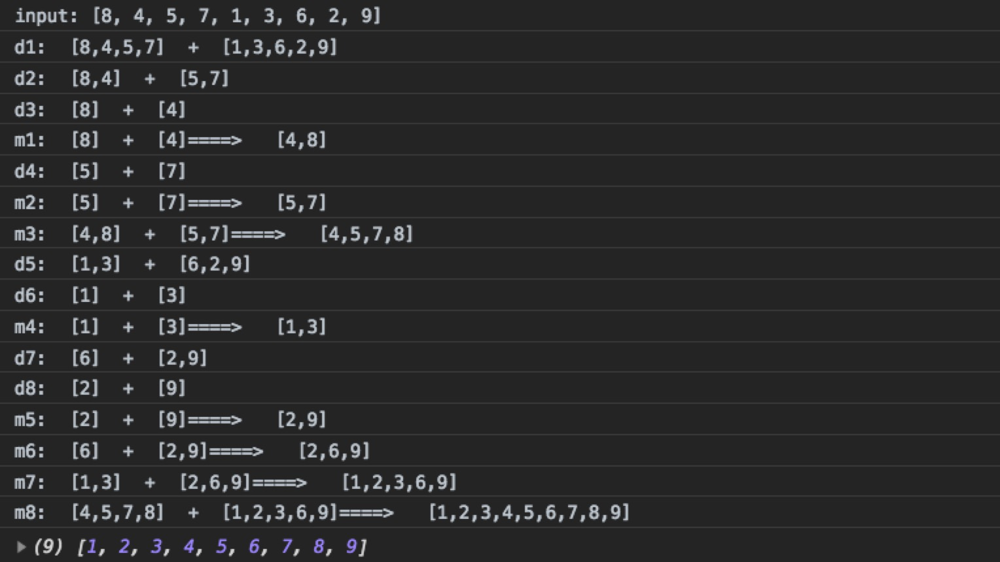
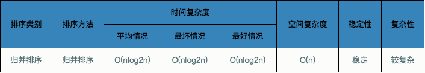

## 基本概念
归并排序（MERGE-SORT）是利用归并的思想实现的排序方法，该算法采用经典的分治（divide-and-conquer）策略（分治法将问题分(divide)成一些小的问题然后递归求解，而治(conquer)的阶段则将分的阶段得到的各答案"修补"在一起，即分而治之)。将已有序的子序列合并，得到完全有序的序列；即先使每个子序列有序，再使子序列段间有序。若将两个有序表合并成一个有序表，称为二路归并。

归并排序其实要做两件事：

（1）“分解”——将序列每次折半划分。

（2）“合并”——将划分后的序列段两两合并后排序。

## 分而治之


## 合并相邻有序子序列

再来看看治阶段，我们需要将两个已经有序的子序列合并成一个有序序列，比如上图中的最后一次合并，要将`[4,5,7,8]`和`[1,2,3,6]`两个已经有序的子序列，合并为最终序列`[1,2,3,4,5,6,7,8]`，来看下实现步骤。


## JavaScript代码实现

```JavaScript
function mergeSort(arr) {
    const merge = (left, right) => {
        let res = [];

        while (left.length > 0 && right.length > 0) {
            res.push(left[0] <= right[0] ? left.shift() : right.shift());
        }

        res.push(...left, ...right); // 存在left和right还有剩余元素的情况

        return res;
    };

    if (arr.length === 1) {
        return arr;
    }
    let middle = Math.floor(arr.length / 2),
        left = arr.slice(0, middle),
        right = arr.slice(middle);

    return merge(mergeSort(left), mergeSort(right));
}
```

## 运行流程输出

其中`d1,d2...dn`为分解输出，`m1,m2...mn`为合并输出



## 算法分析



## 参考资料

[排序七 归并排序](http://www.cnblogs.com/jingmoxukong/p/4308823.html)

[图解排序算法(四)之归并排序](https://www.cnblogs.com/chengxiao/p/6194356.html)

[【MDN】Array.prototype.slice](https://developer.mozilla.org/en-US/docs/Web/JavaScript/Reference/Global_Objects/Array/slice)

[【百度百科】 归并排序](https://baike.baidu.com/item/%E5%BD%92%E5%B9%B6%E6%8E%92%E5%BA%8F/1639015?fr=aladdin)
